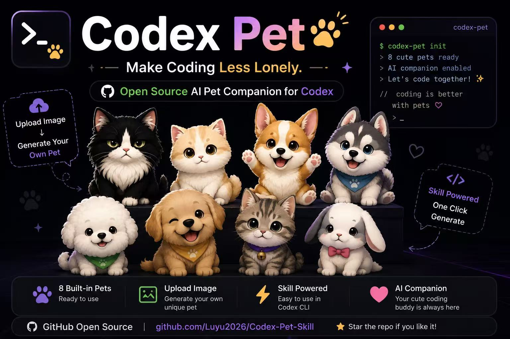

# Codex Pet Skill

<div align="center">

## 让写代码这件事，少一点孤独感



[](https://github.com/openai/codex)
[](skills/codex-pet-maker/SKILL.md)
[](#使用声明)

</div>

---

## 这是什么

`Codex Pet Skill` 是一套给 Codex 自定义桌面宠物用的开源工作流。

你给它一张照片、表情包或角色图，它会帮你生成一整套可以放进 Codex 的宠物包：待机、走路、打招呼、开心、报错、进度条、写代码等动作都会整理成 Codex 可识别的 spritesheet。

简单说：你负责给图和想法，它负责把图变成陪你写代码的小宠物。

## 它解决什么问题

直接让 AI 画宠物很容易翻车：

- 生成出来的图看着可爱，但放进 Codex 后会串格、重影、裁切。
- 往左移动却向右跑，往右移动却向左跑。
- 白色宠物抠图时被背景清掉一半。
- 每次重新做都要反复试错，不知道哪里出问题。

这个仓库把这些坑沉淀成了一个可复用 skill：生成、打包、清理、方向检查、本机安装、文档教程都放在一起，后续做新宠物不用从零摸索。

## 核心能力

- **一图生成宠物**：猫、狗、兔子、卡通角色、人物头像都可以作为参考。
- **Codex 格式打包**：自动整理成 `8 x 9`、`1536 x 1872` 的宠物 spritesheet。
- **方向自检**：检查第 2 行向右、第 3 行向左，避免“左移右跑、右移左跑”。
- **重影修复**：通过 grid-check、repack 和留白检查处理串格、贴边和残影。
- **本机安装**：复制到 `~/.codex/pets` 后即可在 Codex 自定义宠物里选择。
- **教程沉淀**：仓库内保留了柯基、哈士奇、金毛、兔子、狸花猫等 0 基础教程。

## 快速安装

把下面这段话发给 Codex，让它自动读取安装说明：

```text
Fetch and follow instructions from:
https://raw.githubusercontent.com/Luyu2026/Codex-Pet-Skill/main/INSTALL.md
```

也可以手动安装：

```bash
git clone https://github.com/Luyu2026/Codex-Pet-Skill.git
cd Codex-Pet-Skill
mkdir -p ~/.codex/skills ~/.codex/pets
cp -R skills/codex-pet-maker ~/.codex/skills/codex-pet-maker
cp -R pets/* ~/.codex/pets/
```

安装后重启 Codex，打开自定义宠物列表即可看到内置宠物。

## 快速开始

安装 skill 后，在 Codex 里直接说清楚“用哪张图做宠物”即可：

```text
用 $codex-pet-maker 根据这张参考图做一个 Codex 桌面宠物。
```

如果你想指定名字，也可以这样说：

```text
用 $codex-pet-maker 根据这张猫咪照片做一个宠物，名字叫狸花猫 Coder。
```

不需要额外说明“安装到 Codex 自定义宠物文件夹”。这是 skill 的默认交付动作：只要用户要求“做桌面宠物”，skill 就应该生成、打包、校验，并安装到 `~/.codex/pets/<pet-id>`。

skill 会默认完成这些步骤：

1. 识别参考图里的形象特征。
2. 用图片生成流程制作软萌宠物 spritesheet。
3. 打包成 Codex 可识别的 `pet.json` 和 `spritesheet.png`。
4. 检查方向、重影、裁切、串格和透明背景。
5. 默认安装到 `~/.codex/pets/<pet-id>`，让它出现在 Codex 自定义宠物列表里。

## 已收录宠物

| 宠物包 | 说明 |
| --- | --- |
| `cream-orange-cat-coder` | 奶油橘白猫宠物 |
| `tuxedo-cat-coder` | 黑白长毛猫宠物 |
| `lihua-cat-coder` | 狸花猫编码伙伴 |
| `rabbit-coder` | 白色兔子编码伙伴 |
| `corgi-coder` | 柯基编码伙伴 |
| `husky-coder` | 哈士奇编码伙伴 |
| `golden-retriever-coder` | 金毛编码伙伴 |
| `pig-hero-coder` | 红衣小猪英雄风格宠物 |
| `酷儿-coder` | 蓝色卡通形象宠物 |
| `陆羽-coder` | 黑衣人物编码伙伴 |

## 仓库内容

- `skills/codex-pet-maker/`：核心 skill，包含生成规范、方向规则和打包脚本。
- `pets/`：已经做好的宠物包，可直接复制到 `~/.codex/pets`。
- `docs/`：0 基础教程和制作经验记录。
- `assets/`：README 图片素材。

## 制作标准

这个仓库默认追求“软萌半立体贴纸风”，优先避免：

- 程序矢量图、像素感、硬边图标感。
- 角色贴边导致的预览重影。
- 宠物左右移动方向反掉。
- 白色宠物被清背景脚本误删。

每个正式宠物包都应包含：

```text
pet.json
spritesheet.png
spritesheet-clean.png
spritesheet-grid-check.png
```

## 使用声明

本仓库内容仅供个人学习、研究和自用，请勿用于商业用途。部分范例宠物可能参考了第三方角色、公开图片或个人照片的视觉特征；使用者应自行确认相关素材和形象的授权边界，并避免分发、售卖或用于任何可能造成权利争议的场景。

如果这个项目帮你做出了喜欢的 Codex 小宠物，欢迎 star，也欢迎提交你自己的宠物包和制作经验。
